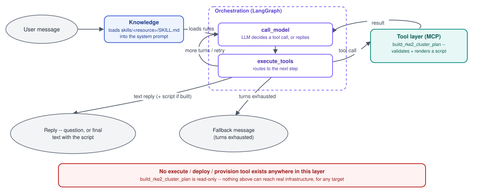

# MultiStack Agentic Layer

Turns a natural-language infrastructure request into a **validated,
readable script against the real MultiStack SDK** — no regex, no
keyword matching. This layer's only job is to hand back that script; it
never provisions, deploys, or otherwise executes anything itself, for
any target, with no exceptions. Running the script it produces is
entirely up to whoever receives it.

This layer is written to be **resource-agnostic**. It has seventeen
resources registered today — RKE2 clusters, block storage, MinIO,
inference (vLLM), the model gateway, rate-limiting policy (rpm/tpm),
the ingress gateway (MetalLB + Istio), Valkey, CNPG/PostgreSQL,
observability (kube-prometheus-stack), the tokenizer, the control
plane (admin/organization) and the portal (admin/organization) — plus a
whole-stack tool that composes them, but nothing in `agentic/` itself
knows or cares which SDK resources those are. Adding an eighteenth is a
matter of following the same four-step pattern described below, not
editing this layer's code. RKE2 is the *original example*, not the
*design*.

Full architecture reasoning and the alternatives considered are in
[`../../docs/architecture-decision.md`](../../docs/architecture-decision.md).
This README is the practical "how it's built, how to run it, how to
extend it" reference.

## The three layers



The loop back into `call_model` is what lets the model take more than one
step (e.g. build a plan, see it validated, then write its final reply)
and what drives retry-on-validation-failure — both go through the same
edge. There is no path anywhere in this layer that reaches real
infrastructure — every tool is read-only by construction, and no
execute/deploy/provision tool is registered at all. See
[`src/mcp_server.py`](src/mcp_server.py)'s module docstring for the
scope this is deliberately kept to.

| Layer | What it does | Resource-specific? |
|---|---|---|
| **Knowledge** | Loads `skills/<resource>/SKILL.md` — the rules the model reads before deciding anything | No — reads whatever's on disk |
| **Tool layer (MCP)** | Exposes each resource's build-and-render action as an MCP tool, validated by the real SDK on every call | No — the MCP *pattern* is generic; one module per resource under `mcp_tools/` |
| **Orchestration (LangGraph)** | Decides whether/when to call a tool, retries on failure, hands back the model's final reply | No — has zero resource-specific logic anywhere |

The one thing that *is* resource-specific is each tool function itself
(`mcp_tools/rke2.py`, `storage.py`, `minio.py`, `inference.py`, `gateway.py`,
`policy.py`, `ingress_gateway.py`, `valkey.py`, `cnpg.py`, `observability.py`,
`tokenizer.py`, `controlplane.py`, `portal.py`) and its matching SKILL.md content — by design, that's the only part
that should ever need to change when a new resource is added. `mcp_tools/full_stack.py`
is the one exception worth knowing about: it composes multiple
resources via the SDK's `Stack` object, so it necessarily knows about
more than one resource at a time — see its own module docstring for why.

## Directory layout

This layer follows the team's `service-template` FastAPI conventions
(flat `src/`, one job per module, settings/errors as their own leaf
modules, tests offline via an injectable fake) for the web-facing part —
see the module table below. `orchestration/`, `mcp_tools/`, `llm.py`
and `skills/` keep the layered split this document's own architecture
decision already reasoned through; see [`src/service.py`](src/service.py)'s
module docstring for why that split doesn't get flattened into one file.

```
agentic/backend/
  Dockerfile                    Multi-stage: base -> test -> runtime.
                                  Built from the REPO ROOT (see Docker below)
  requirements.txt
  pytest.ini                    pythonpath = src, for `cd agentic/backend && pytest -q`
  .env.example                  Copy to agentic/backend/.env
  src/
    main.py                       App factory: logging + wiring
                                    (uvicorn main:create_app --factory)
    router.py                     HTTP routes (thin: parse -> delegate -> wrap)
    service.py                    AgenticService -- the injectable seam
                                    between routes and the orchestration graph
    settings.py                   env-driven config (one Settings class)
    errors.py                     error types + JSON error responses
    dependencies.py               X-API-Key auth guard
    llm.py                        Provider-agnostic chat model factory
                                    (the only file allowed to name a vendor,
                                    e.g. ChatGroq/ChatAnthropic)
    mcp_server.py                 Defines the shared FastMCP `mcp` instance
                                    and imports each mcp_tools/ module for
                                    its registration side effect -- thin,
                                    no tool logic of its own
    mcp_tools/
      rke2.py                       build_rke2_cluster_plan
      storage.py                     build_storage_plan
      minio.py                        build_minio_plan
      inference.py                     build_inference_plan
      gateway.py                        build_gateway_plan
      policy.py                          build_policy_plan
      ingress_gateway.py                  build_ingress_gateway_plan
      valkey.py                            build_valkey_plan -- returns a
                                             real computed connection
                                             string (see its own SKILL.md)
      cnpg.py                               build_cnpg_plan -- installs the
                                              CloudNativePG operator, and
                                              optionally a real Postgres
                                              cluster+database on top; see
                                              its own SKILL.md for the
                                              plaintext-password caveat
      observability.py                      build_observability_plan --
                                               kube_prometheus_stack
                                               (Prometheus/Alertmanager/
                                               Grafana); requires storage,
                                               same as MinIO
      tokenizer.py                          build_tokenizer_plan -- a
                                              token-counting service; its
                                              endpoint wires into a
                                              composed type="tpm" policy
      controlplane.py                       build_controlplane_plan --
                                              admin or organization API
                                              service; requires a real
                                              database (CNPG) + cache
                                              (Valkey) already on the
                                              cluster; see its own
                                              SKILL.md for the
                                              Secret-name-only caveat
      portal.py                             build_portal_plan -- admin or
                                              organization web UI; its
                                              api_upstream auto-wires from
                                              a composed matching-type
                                              controlplane
      full_stack.py                         build_full_stack_plan -- composes
                                              everything above via the SDK's
                                              Stack; four combinations
                                              auto-wire (see its own module
                                              docstring): valkey->policy
                                              cache_url, minio->inference
                                              s3_endpoint_url, tokenizer->
                                              tpm policy tokenizer_url, and
                                              controlplane->portal
                                              api_upstream
    orchestration/
      graph.py                      LangGraph orchestrator -- the
                                      conductor. No resource-specific code.
      knowledge.py                   Loads skills/*/SKILL.md from disk,
                                       generically; takes the selection
                                       to include
      selection.py                    Picks the skills/tools one request
                                        needs, from the triggers each
                                        SKILL.md declares about itself --
                                        no hand-maintained keyword list
      tools.py                        Wraps each mcp_tools/ function for
                                        in-process use by the orchestrator
    skills/
      <resource-name>/SKILL.md      Domain rules for one resource -- e.g.
                                      skills/rke2-cluster/SKILL.md,
                                      skills/storage/SKILL.md,
                                      skills/minio/SKILL.md,
                                      skills/gateway/SKILL.md,
                                      skills/policy/SKILL.md,
                                      skills/ingress-gateway/SKILL.md,
                                      skills/inference/SKILL.md,
                                      skills/valkey/SKILL.md,
                                      skills/cnpg/SKILL.md,
                                      skills/observability/SKILL.md,
                                      skills/tokenizer/SKILL.md,
                                      skills/controlplane/SKILL.md,
                                      skills/portal/SKILL.md
    examples/
      chat.py                        Interactive REPL for manual/live testing
      agentic_orchestration.py        Scripted example run
  tests/                           conftest.py (fake orchestration graph,
                                     offline) + tests for each mcp_tools/
                                     module and the HTTP service
```

## Adding a new resource type

This is the part that matters for staying generalized. Once real SDK
code exists for a new resource, adding it here is four steps, and
**none of them touch `orchestration/` or `service.py`**:

1. **Real SDK code** already lives under `multistack/`, unmodified —
   nothing to do here, it's a prerequisite.
2. **Write `skills/<resource-name>/SKILL.md`** — real class signatures,
   real field constraints, in the same style as
   [`src/skills/rke2-cluster/SKILL.md`](src/skills/rke2-cluster/SKILL.md).
   This is what the model reads to understand the resource's rules —
   put anything here that's a *rule*, not a *type*.
3. **Write `mcp_tools/<resource-name>.py`** (a `build_<x>_plan` function,
   following the pattern in `mcp_tools/rke2.py`) — read-only, validates
   against the real SDK, and renders the resource's deployable script in
   one call. No execute/deploy tool: this layer never provisions
   anything, for any resource.
4. **Register the new tool** in
   [`src/orchestration/tools.py`](src/orchestration/tools.py)'s
   `ALL_TOOLS` list, and add an import for it in `mcp_server.py`'s own
   `from mcp_tools import ...` line. That's the entire integration
   point — `graph.py` picks up whatever's in `ALL_TOOLS` automatically.
5. **Add one row to `CAPABILITIES`** in
   [`tests/test_sdk_sync_capabilities.py`](tests/test_sdk_sync_capabilities.py).
   That single row turns on the whole drift suite for the new resource:
   that its tool takes the real spec type, that its SKILL.md documents
   every real field and options class, that it's registered, that it's
   composable in the whole-stack tool, and that every backend method its
   generated script calls still exists on the SDK.

**If the new resource depends on others** (needs a cluster, needs
another resource already installed), also consider whether
`mcp_tools/full_stack.py` should learn to compose it too — that's the
one file that's allowed to know about more than one resource, since its
whole job is wiring them together via the SDK's `Stack` object. See its
module docstring for the placeholder-field pattern it uses for
Stack-filled inputs (e.g. a not-yet-created cluster's kubeconfig path).

## Setup

```bash
# From the repo root
pip install -e .                          # the SDK itself
pip install -r agentic/backend/requirements.txt      # this layer's own dependencies

cp agentic/backend/.env.example agentic/backend/.env
```

Fill in `agentic/backend/.env`:
- `LLM_PROVIDER` — which model provider `src/llm.py` should construct
  (`groq` by default; `anthropic`/`openai` also supported — see
  `src/llm.py` to add another)
- The matching API key for that provider (`GROQ_API_KEY`, etc.)
- `SERVICE_API_KEY` — required for `src/main.py`; generate one with
  `python -c "import secrets; print(secrets.token_urlsafe(32))"`

## Running it

**Interactive chat** (manual testing, demos — talks to the orchestrator
directly, no server needed):
```bash
cd agentic/backend/src && python -m examples.chat
```
See [`EXAMPLE_PROMPTS.md`](EXAMPLE_PROMPTS.md) for a scripted set of
prompts covering the clarifying-question path, a validation rejection,
asking it to "deploy" (it still only ever hands back a script), and
multi-turn conversation — useful both for a live demo and for manually
sanity-checking a change.

**The production service** (a real HTTP API, authenticated, for anything
else that needs to reach this — a website, another service, a script).
Follows `service-template`'s app-factory convention:
```bash
cd agentic/backend/src && uvicorn main:create_app --factory --host 0.0.0.0 --port 8000
```
See the docstring at the top of [`src/main.py`](src/main.py) for the
full endpoint list and request/response shapes.

**The standalone MCP server** (for an external MCP client — Claude
Desktop, another AI tool — to reach the same tool directly, over the
real MCP protocol rather than in-process):
```bash
cd agentic/backend/src && python -m mcp_server
```

## Testing

```bash
cd agentic/backend && pytest -q          # this layer only (matches service-template)
# or, from the repo root:
python -m pytest agentic/backend/tests -v
```
Fast and fully offline — no LLM calls, no network, no real
infrastructure. `tests/conftest.py` injects a fake orchestration graph
via `create_app(graph=...)` (same seam `service-template`'s own
`conftest.py` uses for its httpx client), so `test_service.py` exercises
routing/auth/error-mapping without a real model. `test_mcp_tools_*.py`
exercises each tool directly against the real SDK's own validation --
there's nothing to stub, since this layer never calls a backend's
create()/update()/delete() itself (that's covered separately by
`tests/backends/`). `test_mcp_tools_full_stack.py` goes one step
further for the composed tool: it actually `exec()`s a generated script
(with only the real infra calls stubbed) to prove the `Stack` wiring
between layers resolves correctly, not just that the script's syntax is
valid.

`test_sdk_sync_capabilities.py` is the drift guard across all thirteen
resources (`test_sdk_sync_rke2.py` is the older, RKE2-specific version
of the same idea). It's what catches the SDK moving underneath this
layer: a field added or renamed on a spec, an options class this layer
never documented, a backend method a generated script still calls by
name. It exists because that drift really happened — the SDK grew
NetworkPolicy support and `IngressGateway.node_selector`, and none of it
reached the SKILL.md files, which is the only place the model ever reads
a field's meaning from.

## Docker

```bash
# From the REPO ROOT (not agentic/backend/) -- this service depends on the
# sibling multistack/ package, which has to be inside the build context.
docker build -f agentic/backend/Dockerfile --target test -t agentic-test . && docker run --rm agentic-test
docker build -f agentic/backend/Dockerfile -t agentic . && docker run --rm -p 8000:8000 agentic
```

Live, end-to-end testing (a real model actually reasoning about a real
request) needs a configured `agentic/backend/.env` and isn't part of the
automated suite — use `agentic/backend/src/examples/chat.py` or
`agentic/backend/src/examples/agentic_orchestration.py` for that.

## The safety model, in one paragraph

This agent can't touch real infrastructure even in principle: there is
no execute/deploy/provision tool registered anywhere in this layer, for
any resource, no matter what the model decides. Every tool (including
`build_full_stack_plan`, which composes multiple resources) is
read-only by construction — it validates and renders a script, full
stop. This is enforced structurally, not by a prompt instruction that
could be argued around. See [`src/mcp_server.py`](src/mcp_server.py)'s
module docstring for the exact scope every new resource's tool must stay
within.

## Known limitations

- **State is in-memory only.** Sessions are lost on restart. See
  `docs/architecture-decision.md` Phase D.
- **One shared API key**, not per-user accounts or role-based access.
  See Phase F.
- **No locking** around shared state — a real concern once more than
  one caller uses this at once.
- **Every capability the SDK currently ships is registered here** (17
  resources plus the composed whole-stack tool). One platform component is
  deliberately absent, because there is nothing in the SDK to wrap:
  **NATS**, which the SDK never deploys — it's referenced only as an
  external URL (`event_backbone_url`) that the gateway, the enricher,
  the limiters and billing all point at. The pattern above is what keeps adding more from requiring changes
  to `orchestration/` or `service.py`.
- **Skills and tools are selected per request, by literal matching.**
  Loading all thirteen SKILL.md files and binding all fourteen tool
  schemas costs ~48,000 tokens before the user has typed anything — more
  than the 32,768-token context of the model this layer runs against, so
  every request overflowed. `orchestration/selection.py` now picks only
  what a request needs (typically 3,000–25,000 tokens, hard-capped below
  a budget so it cannot overflow again). This is the Phase C selection
  step from `docs/architecture-decision.md`, done by matching the trigger
  terms each SKILL.md already declares in its own frontmatter rather than
  by embeddings — no index to build, nothing to call at run time.
  Embeddings remain the better answer once ranking, not just matching, is
  what the skill set needs.

## Roadmap

See [`../../docs/architecture-decision.md`](../../docs/architecture-decision.md)
for the full phased plan (MCP -> LangGraph -> RAG, in that order, each
adopted when its own trigger fires) and the reasoning behind every
choice made in this layer.
